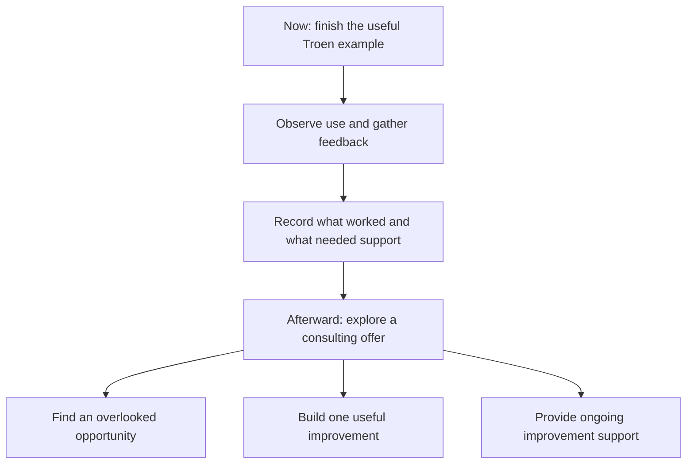

# Consulting that comes with implementation

Internal concept board · September 11, 2026 · Revisit after the Troen project.

**A possible offer:** “I help companies improve one difficult, recurring process,
then build the tools and procedures that make the improvement usable.”

These are ideas to inspect and reshape, not validated services, pricing, market
research, or additions to the current project plan. No new work is assigned.

## Keep today and tomorrow separate

| Project level: now | Business level: afterward |
|---|---|
| Deliver the agreed Troen proof of concept | Identify which methods could help another company |
| Make research organized, traceable, and useful | Test whether companies value an implementation service |
| Verify specific behavior and preserve existing work | Learn how to scope, price, support, and repeat the work |
| Record evidence and unknowns | Develop a case study only with suitable permission |

The narrower prospect-research example is a starting demonstration, not a change
to the coordinator’s existing plan. The broader partner strategy remains exploratory.

## Idea 1: find the opportunity the company has not articulated

**Picture this:** a small event company has several spreadsheets and capable staff,
but nobody has a clear view of which inquiries need attention. They ask for a nicer
spreadsheet; the useful discovery may be that handoffs lack an owner.

**A possible engagement:** inspect one recurring process and show one concrete
improvement the company can react to.

**What they receive:**

- A one-page map of the current process, using a representative example.
- Three observed friction points, with evidence and clearly labeled assumptions.
- One recommended improvement, including why it deserves attention first.
- A small mockup or editable sample showing what better could look like.

**Example glimpse:** an inquiry list with an owner, last action, and next action.
A static sample is enough initially; it must not imply a connected live system.

**Question to validate later:** “Does this describe a problem you actually face,
and would solving it matter enough to prioritize?”

**Boundary:** avoid turning discovery into an open-ended audit or assuming that
an attractive demonstration proves demand. Implementation is separately scoped.

## Idea 2: build the improvement

This connects discovery to a result someone can use.

**Picture this:** staff repeatedly gather the same information, copy it between
files, and manually prepare a summary. You build an editable template and a small
script that prepares the draft while preserving corrections and showing sources.

**What they receive:** a working increment, representative inputs and outputs,
proportionate checks, a short operating guide, and a clear owner for maintenance.

For Troen, the candidate example is moving from scattered prospect research to
an organized shortlist with evidence. Existing project work determines its actual
scope. A spreadsheet, procedure, or small script may be sufficient; a custom app
must earn its place through usefulness.

**Question to validate later:** “Can someone use this successfully, and is the
result worth the preparation, review, correction, and upkeep?”

## Idea 3: stay involved as an improvement partner

**Picture this:** the first solution works, but the company’s sources, staff, and
priorities change. A named person keeps it useful and tackles the next small issue.

**A possible engagement:** a bounded recurring service after a successful pilot.

**What they receive each agreed cycle:**

- A check that the supported workflow still works.
- A short account of use, failures, corrections, and unresolved issues.
- One prioritized improvement, within an explicit effort and cost allowance.
- Updated instructions and a handoff showing what changed.

**Example glimpse:** a monthly note: “Two source changes repaired; one confusing
step simplified; next candidate is reducing duplicate entry.” This is illustrative,
not a report of actual Troen activity.

**Question to validate later:** “Is there enough recurring value to justify ongoing
support, and who inside the company will own the process?”

**Boundary:** define support hours, response expectations, third-party costs,
access, and exclusions. Ongoing support should not imply unlimited development.

## What the offer could look like

| Stage | Tangible result | Possible commercial shape, untested |
|---|---|---|
| Discover | Process map and one inspectable opportunity | Fixed-scope discovery engagement |
| Implement | One usable, verified improvement and handoff | Milestone-based project |
| Improve | Maintenance and a bounded improvement cycle | Recurring support agreement |

No prices or revenue projections are proposed yet. Scope and measured effort
should inform them; willingness to pay still needs to be tested.

## A future case-study outline

Capture these after the project, using evidence already collected where possible:

1. **Before:** what made the selected task difficult?
2. **Delivered:** what did the company actually receive?
3. **Used:** what did someone try, accept, or reject?
4. **Changed:** what improved, and what did not? Include review and upkeep effort.
5. **Repeatable:** what could transfer to another company, and what is specific?

Distinguish a working demonstration from adopted software, measured savings,
revenue, or customer outcomes. Obtain permission before sharing client examples;
use synthetic examples when permission or reuse rights are absent.

## Revisit after completion

Choose one concept to test with a small conversation and an inspectable example.
Do not launch all three services at once. Look for evidence of usefulness before
expanding the offer or building a reusable product.

Related foundation: [the existing measured path to future opportunities](POSITIONING-AND-OPPORTUNITY.md#8-a-measured-path-to-future-opportunities).
