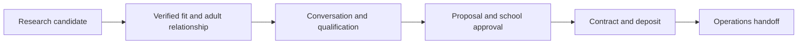

# Carnegie Hall: demonstration-first strategy

[Start here](README.md) · [Business evidence](BUSINESS-CONTEXT.md) · [Positioning and opportunity](POSITIONING-AND-OPPORTUNITY.md) · [Zoho research](ZOHO-RESEARCH-PROMPT.md)

Reference revision: September 11, 2026. Research and reliability priorities began
from the implementation at `5155cfa`; [PROGRESS.md](PROGRESS.md) records subsequent
verified changes. This is the business and delivery strategy; work remains planned
unless explicitly marked verified. The initial research-priority revision was
planning-only. The later bounded implementation below does not authorize
subscriptions, paid trials, broader scraping, outbound contact or external changes.

September 11 assignment addendum: alongside Claude's partner pilot, Codex takes
one bounded empty-scrape preservation fix with regression tests. The
[assignment ledger](coordination/2026-09-11-partner-pilot.md#codex-parallel-assignment)
reserves separate files and defines acceptance. The empty/unusable-batch guard is
now implemented with focused passing regressions and committed as `e6e493e` under
the later wrap-up authorization. Nonempty partial results and the broader legacy
findings remain open.
Claude delivered the MTC partner pilot as `e171954`; it is locally integrated as
`a7ceefc` with coordinator corrections recorded in progress. The user narrowed its
workbook/demo connection to a small illustrative research candidate, now implemented
locally. NYIMF/Troen remains explicitly unconfirmed; the example carries no outreach
strategy or recommendation to contact MTC. The internal partner sheet stays separate.
Business questions remain internal and do not gate the example. The partner draft
does not depend on the preservation fix. The MTC connection/review corrections are
committed as `f36bdf1`. The final whole-project audio presentation remains deferred;
local nightly source packs now follow [the accepted wrap-up routine](SESSION-WRAP-UP.md).

This is a revisable working plan. Update the relevant section when evidence or an accepted decision changes the approach, and reconcile affected strategies and summaries. Use [PROGRESS.md](PROGRESS.md) for actual implementation status and the short reason behind material revisions. A suggestion becomes an accepted decision only through an explicit choice or work already authorized by the user.

## 1. Purpose and success

Help Troen find suitable school ensembles and tour-company partners for **March 3, 2027**, prepare for informed conversations, and keep promising opportunities moving toward bookings. The working employee report is one participating group and a need for approximately ten more ensembles. **Ten additional ensembles is a provisional target requiring capacity confirmation.**

The proof of concept should make the value visible before asking Troen to assemble requirements, account details, or relationship exports. The logistics and software developer carries the initial research, synthesis, and design workload. Troen can react to a concrete, useful example.

Quality comes from connecting the pieces: a sourced profile explains an opportunity, the tailored material supports a better conversation, and the example workflow shows what happens next. The POC can be thorough and polished while remaining incomplete as an operating business system. Real research and illustrative workflow activity must remain distinguishable.

Troen's wider workflow matters: school approval, fundraising, proposals, contracts, deposits, travel suppliers, registration, and final coordination. Demonstrate those connections at an appropriate depth without requiring a complete process-mapping exercise from the business.

## 2. Keep, change, and defer

| Original asset | Decision | Reason and condition |
|---|---|---|
| School research library | Keep as candidate evidence | The current file has 206 rows, 125 school URLs, five director names, and two stored director emails. It is not a contact-ready Carnegie list. |
| Public-source discovery and scraping | Keep and retarget selectively | Performance records can reveal relevant programs; expand toward concert ensembles only where sources support it. |
| Saved sources and timestamps | Keep and strengthen | A claim must be attributable to the correct school, ensemble, person, and event. |
| Spreadsheet exports and short briefs | Keep the formats | They are familiar, portable, editable, and useful in a meeting. |
| Tests, quality checks, and refresh tooling | Keep with repairs where used | Preserve reviewed identities and prior evidence; do not trust the existing unattended refresh path yet. |
| Parade scoring, tiers, and geography | Replace for Carnegie use | An Orlando travel signal or top-50 ranking is not Carnegie fit, willingness, or available budget. |
| Original client packet | Retain as historical reference | Rewrite active materials around March 3; remove unsupported readiness and automation claims. |
| Broad parade expansion and source completeness | Defer | Completing every old source is not a prerequisite for a useful Carnegie pilot. |
| CRM replacement, payment platform, comprehensive dashboard | Defer | Require evidence of a workflow gap and a successful smaller trial. |
| Employment/interview narrative | Exclude from revised materials | Retain the CS-background business explanation explicitly requested by the logistics and software developer. |

Baseline evidence: [current prospect file](../../data/final/prospects.csv) and [audit](../AUDIT-2026-09-10.md). The audit found one of the two stored director emails attributed to the wrong role; row counts do not establish correctness.

## 3. Five initial deliverables

| Deliverable | What we prepare independently | Ready to demonstrate | Needed before live use |
|---|---|---|---|
| March 3 event brief | A clear account of the date, photographed session, and documented performance experience | Source-backed facts, readable inclusions, and concise handling of unknown commercial terms | Confirm sellable inclusions, eligibility, capacity, price, and deadlines before a firm offer |
| Troen offer comparison | Focused public research on comparable providers and experiences | Dated sources, fair comparison, visible unknowns, potential strengths distinguished from proven differences | Recheck time-sensitive facts before distribution |
| School and partner opportunity workbook | A small set of reviewed public-source cases with evidence, potential fit, and next steps | Correct identities and adult roles; contact fields remain blank when uncertain; no invented interest | Check relationship ownership, suppression, and the permitted contact path before approaches |
| Director and partner materials | Event sheet, practical FAQ, partner sheet, and editable proposal structure | Polished examples consistent with the event brief; no unsupported commercial promises | Approve firm commercial details and recipient-specific terms |
| Example action brief | Illustrative conversations, proposal revisions, approvals, payments, supplier issues, and next actions | Every action reconciles to a clearly labeled example record | Reconcile with actual business records and responsible roles before operational use |

Use editable workbook and document sources, with PDFs as delivery copies. A compact local interactive demonstration can make these five outputs easy to inspect. It is a presentation layer, not a requirement to build a full dashboard, live inquiry service, or CRM. Detailed execution guidance lives in the [eight workstream strategies](strategies/README.md).

The first batch can contain roughly six to twelve total school and partner cases, selected for evidence quality and useful variety. This is a proposed demonstration size, not a lead or booking commitment. Include one weak-fit or insufficient-evidence case to show judgment.

## 4. Research schools and partners

Research public school programs, relevant tour partners, and existing-relationship clues as the available evidence allows. There is no required ordering of existing relationships, partners, and new schools. We do not know which channel performs best for Troen. Track channels separately during later real use; a demonstration sample cannot establish conversion rates.

For schools, establish the institution and the particular ensemble. Concert bands, orchestras, and choirs are research categories suggested by the materials, not an approved March 3 eligibility list. Verify the adult's current role and school using a current official program or staff source. Record travel/performance evidence as evidence of past activity; do not infer current funds, approvals, artistic eligibility, or availability.

For partners, research public school-music relevance and territory; keep current Troen relationship status unknown unless supported. For the POC, describe possible divisions of responsibility as hypotheses. Before a commercial approach, establish who may contact the director, who signs/pays, and whether any net-rate, commission, hold, or information-sharing arrangement applies. The March 31 schedule gives relationship clues, not permission to approach those schools independently.

The service-area image supports a broad geographic preference with exceptions; precise territory guidance can wait until an operational exclusion is proposed. The original East Coast sheet is not an authoritative boundary for the new opportunity.

### Minimum useful information

Group the workbook around useful views. The developer fills them from available evidence; missing business details remain unknown, and example activity is kept in separate illustrative records. This is a record structure, not a form Troen must complete:

- **Who is this?** School, location, ensemble name/type, direct or partner channel, partner if relevant, and a stable identity that survives corrections.
- **Why consider them?** Specific performance/travel evidence, dates, sources, and a short explanation of potential fit.
- **Who can discuss it?** Adult name, verified role, published contact if available, source/verification date, relationship owner, and permitted-contact status.
- **What is known about the trip?** Estimated performers with source, date feasibility, package needs, budget status, school approval path, and blockers. Unknown is a valid entry.
- **What happens next?** Current status, last substantive contact, next action, responsible person, deadline, proposal version, and booking evidence where supplied.

School enrollment, performer count, total travelers, audience seats, and ensemble bookings must remain distinct. A school may bring multiple ensembles; a partner may bring multiple schools. Count each actual ensemble booking once.

## 5. Collect carefully and preserve judgment

The useful research product is a supported reason for a conversation. For example: “The school has an active concert orchestra and a documented recent performance trip. Its current director is listed on the official site. March availability and budget are unknown.”

Use public organizational and professional information, permitted APIs, and employee-supplied exports where appropriate. Preserve the existing source links, caching, modest per-host request limits, and no-guessed-contact rule. Resolve unavailable robots policies conservatively, check redirects before crawling a new destination, and report blocked or unclear sources rather than bypassing them. The [Robots Exclusion Protocol](https://www.rfc-editor.org/rfc/rfc9309.html) describes crawler rules; those rules are not access authorization.

A research record and a permitted marketing contact are different. The supplied Zoho assessment identifies an important import/email restriction. Keep research staging separate from Zoho marketing or email-enabled imports until the exact permitted handoff is established; see the independently checked vendor-policy links in the [research handoff](ZOHO-RESEARCH-PROMPT.md). Do not invent permission flags from a public email address or a partner relationship.

Preserve human corrections and relationship notes when research is refreshed. A failed source must not erase prior work. Repeated runs must not create duplicate schools, contacts, or ensemble opportunities. Review price, contract, capacity, and payment representations with the responsible person; a model-generated statement is not booking evidence.

The original audit remains actionable. For the pilot, repair the affected path or use a reviewed manual handoff. Before a broad rebuild or scheduled refresh, complete the relevant identity, failure-preservation, freshness, attribution, and export checks. Do not make every unrelated repair a prerequisite for preparing the event brief or reviewing a small batch.

### Research and reliability priorities

Apply these priorities to the path selected for the next useful deliverable.
They are the user's priority order, not six phases that must finish before the
POC can continue. The **small MTC research candidate example** is now connected;
the earlier matching-sheet connection is deferred following the user's narrower
scope. The [March 3 FAQ draft](<materials/Troen - Carnegie Hall Director FAQ.md>)
now exists in Markdown and Word and is connected to the Materials view through
protected downloads. It uses locally rechecked event evidence with business unknowns
retained internally; no broader partner work is implied. Use reviewed, separate inputs and the
existing demo builders where they suffice; repair a legacy boundary before using
it to change valid data. A bypass must state what it avoids and what remains open.

| Priority | Business purpose and bounded work | Audit reference | Relative effort when implemented |
|---|---|---|---|
| 1. Preserve work | Keep researched identities, existing records, source evidence, and manual notes/document edits through correction and repeated rebuilds. Retain stable IDs and reviewed resolution history. | A01, A06, A10 | Medium for one boundary; high across the legacy pipeline |
| 2. Verify identity and attribution | Establish school, city/state, district and NCES ID/vintage where available; associate name, role, contact and institution within explicit evidence. Keep ambiguous identities and wrong-role contacts in review. | A02, A07, A13 | Medium; begin with selected cases |
| 3. Preserve records on source failure | Distinguish complete, incomplete, blocked and confirmed-empty results by source/year. Only a validated complete partition may replace prior records; define cache freshness and retain prior snapshots. | A03, A04, A11 | High for shared refresh; small reviewed bypass for the next example |
| 4. Preserve the meaning of appearances | Record planned versus completed participation separately from event type, including competitions. Retain evidence for individual claims and distinguish event, publication, retrieval and review dates. | A08, A09, A13 | Medium for a bounded evidence/consumer change |
| 5. Reconcile the outputs | After accepted research changes, reconcile scores where used, counts, workbooks, Word/Markdown and demo text from the same reviewed inputs; preserve edits and show added/changed/removed/retained records. | A09, A10, A12, A14 | Medium; the two demo builders still require a coordinated manual run |
| 6. Close useful source gaps | Use local PDF extraction, visual/OCR checks or permitted browser rendering for a demonstrated gap. Compare alternatives on accurate claims, retained evidence, full cost and upkeep. | A11, A13; deferred source coverage | Small to medium for a fixed sample; unknown until the gap is observed |

Effort labels are planning estimates, not commitments. A new service is not a
repair for incorrect identity joins or destructive writes. Before implementing a
row, identify its exact files, preservation boundary, and acceptance checks in
[PROGRESS.md](PROGRESS.md#research-and-reliability-acceptance-checks).

**Verified versus unresolved:** `e4e6a9b` repaired the SerpAPI credential/error
path with bounded regression tests. The demo tests protect edited outputs,
cross-school source references and spreadsheet text. They do not repair legacy
identity matching, scraping completeness, freshness, scoring or exports. See the
[current reliability status](PROGRESS.md#verified-repairs-and-unresolved-findings);
the September 10 audit remains a historical snapshot.

**Discovery and extraction:** reuse the verified SerpAPI client for discovery,
starting with the existing cached partner query where useful. Verify claims on
the underlying sources. Evaluate Firecrawl only on a small representative sample
before considering adoption; consider Zyte or Apify only after documenting a gap
the existing route and Firecrawl do not adequately address. The
[evaluation protocol](strategies/07-software-and-automation-fit.md#bounded-extraction-tool-evaluation)
defines accuracy, provenance, cost, maintenance and stop criteria. No trial or
scraping run is started by this plan update, and the partner sheet does not wait
for that evaluation.

## 6. Booking and delivery workflow

This is a working model to demonstrate with illustrative records. It does not depend on Troen documenting its complete process first. School approval, fundraising, proposal revisions, and supplier checks can overlap; do not force them into a misleading one-way status sequence.

Keep separate evidence for eligibility, approval, contract, payment due, payment received, and business-confirmed booking. A recommended booking rule is an accepted contract plus the required deposit, or a documented business-authorized exception; Troen’s actual rule is needed before operational booking counts are used, not before demonstrating the workflow. A form submission or signed document alone does not establish settled payment.

Use the logistics context to capture the next useful fact. If the group needs transport, note route and timing requirements. If another company arranges travel, identify the partner's responsibilities. If an approval deadline is unknown, flag that gap. Operational follow-through can initially remain in Troen's established documents and systems.

## 7. Demonstration sequence and dependencies

1. **Organize the evidence already supplied.** Separate March 3 facts, the shared brochure, March 31 examples, other trips, employee reports, and illustrative records. Draft the useful event story and retain commercial gaps internally.
2. **Research a varied sample.** Use public sources for schools, partners, and provider comparisons. Private accounts, relationship lists, and complete capacity calculations are not prerequisites for internal research.
3. **Make one connected example work.** Show a sourced opportunity, a tailored material, and an explicitly illustrative follow-up/approval scenario. Fix or bypass defects affecting that example.
4. **Extend and polish the useful pattern.** Complete the small workbook, comparison, director/partner materials, and example action brief. Give them a coherent, inspectable local presentation.
5. **Rehearse and verify.** Check source links, event/date separation, identities, export readability, illustrative-state labels, and local behavior. Show concrete outputs, not a questionnaire.
6. **Resolve only the facts needed for an intended live action.** If Troen wants to use a particular piece, consult the [internal decision register](INTERNAL-DECISIONS.md). A firm quote, a commercial approach, and a CRM import require different information.
7. **Automate proven repetition when justified.** Start with local document assembly or summaries. Schedule or connect systems only after the relevant increment works and its actual use is authorized.

This is a suggested build sequence, not a delivery-date promise or channel ranking. It carries the work forward using available evidence. The [detailed strategies](strategies/README.md) specify outputs, steps, tools, handoffs, and stopping points for each chunk.

## 8. Acceptance and measurement

For the first deliverables, check that every selected opportunity has an attributable identity and fit explanation; ambiguous fields remain unverified; March 31 details are not promoted as March 3 facts; duplicate channels do not inflate totals; and all demonstration facts agree with the sourced event brief. Firm customer promises require business confirmation before live use.

For the research workflow, exercise a corrected school identity, two same-name schools, a wrong-role staff contact, a failed refresh, a duplicate partner/direct opportunity, an unknown date, and a spreadsheet export containing unusual text. Relevant defects must be caught or explicitly routed to review. These checks protect the increment; they are not a request to rebuild the whole platform.

For the demonstration, measure traceability, useful next actions, consistency, readable outputs, and a coherent walkthrough. During later real use, track qualified ensembles by channel, substantive conversations, requested proposals, approval blockers, contract/deposit milestones, and lost/deferred reasons. Record bookings and paid performers separately. Raw row counts, generated documents, email opens, and AI scores are not primary evidence of business value.

The **20–40% reduction in hands-on preparation time is an untested planning hypothesis**, not measured savings, a whole-business productivity forecast, or a sales guarantee. Initially record the developer’s preparation and review effort on representative examples. Do not assign Troen a time study to receive the POC. A later savings claim requires comparable baseline work, including review and correction time. Record setup effort, recurring maintenance, and software costs separately. See [productivity expectations](POSITIONING-AND-OPPORTUNITY.md) for the limits of this estimate.

## 9. Later opportunities

Potential extensions include an inquiry page, reusable proposal assembly, supplier/deadline checklists, permitted CRM synchronization, post-event feedback, repeat-booking reminders, and a partner program. Test each against an observed problem and the existing tools first.

A broader research and operations-support service may become viable after Troen uses the pilot and its benefits and upkeep are demonstrated. Other events and clients are future possibilities. No automatic selling, autonomous contracting, discounting, CRM replacement, payment processing, or new service launch is implied by this plan.
