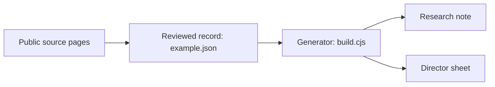

# Start here: follow one school through the project

A guided learning page for Connor · September 11, 2026.

**Start by clicking the research note below. You do not need a terminal, a server,
or a new repository.** Keep this page and our conversation beside each other.
These links point to this Mac’s current project; they are not cloud links.

## What we are trying to help someone do

Troen needs to understand why a school might be relevant to its Carnegie Hall
program, what evidence supports that view, and what remains unknown. Wando is our
existing example. It is a research candidate, not a confirmed interested customer.

Think of the workflow as preparing a recipe card: sources supply the ingredients,
the reviewed record organizes them, and the generator presents them in a useful
form. The limit of that analogy: software can format a claim, but cannot make an
unsupported claim true.



We will read the finished research note first because it is easier to understand,
then look underneath it. The note and director sheet are both outputs of the
structured record; the note does not automatically feed information back into it.

## Stop 1: understand the evidence

[Open the Wando research note](</Users/connormurphy/Desktop/Projects/band-charter-outreach/demo/carnegie-hall/exports/Troen - Wando Research Note.md>)

Read **Evidence**, **Interpretation**, and **Unknowns**. Notice that they do
separate jobs: what the source supports, why it might matter, and what we do not
know. The source register at the bottom gives you clickable original pages.

For this first pass, follow **S04**, the Midwest Clinic entry, through the local
files. The stored research attributes a performance to December 19, 2019; it does
not establish a 2027 travel plan. The source was reviewed in the recorded research
on September 10, 2026. This learning page does not freshly verify the external site.

**Talk through:** “What does this evidence let us say, and what would be a leap?”

## Stop 2: see how the computer stores the same idea

[Open the structured Wando record](</Users/connormurphy/Desktop/Projects/band-charter-outreach/demo/carnegie-hall/example.json>)

Use Find for `Historical performance`, then `S04`. Look at `school.evidence`
and the separate `sources` list. `source_id` connects a statement to its source.
JSON is simply a structured text format: named fields, values, and lists.

Also find `school.fit` and `school.unknowns`. The computer stores interpretation
and uncertainty explicitly, rather than making you remember which is which.

**Talk through:** “If the performance year were corrected, which statement and
source entry would need review?” Do not change the shared record during this tour.

## Stop 3: see what the reader receives

[Open the director sheet](</Users/connormurphy/Desktop/Projects/band-charter-outreach/demo/carnegie-hall/exports/Troen - Wando Director Sheet.md>)

Read **Why this conversation may fit Wando**. Compare it with the evidence and
unknowns. The wording should remain useful without turning historical participation
into current interest. This is a discussion draft, not a sent offer.

**Talk through:** “Could a reader mistake this for evidence that Wando wants to go?”

## Stop 4: look at the machinery, one function at a time

[Open the generator](</Users/connormurphy/Desktop/Projects/band-charter-outreach/demo/carnegie-hall/build.cjs>)

Find `researchMarkdown`. We can trace how it takes fields from the record and
turns them into readable Markdown. You do not need to understand the entire file.
The generated note is an output; deliberate source changes and a protected rebuild
are the normal route to updated outputs.

[Open the checks](</Users/connormurphy/Desktop/Projects/band-charter-outreach/tests/carnegie_demo.test.cjs>)

Find `a portable research note can be produced without a verified contact`.
This check removes the contact from an in-memory example and verifies that the
result says it is unverified instead of printing broken or invented information.
It does not remove the contact from the actual JSON file.

**Talk through:** “What mistake is this check protecting the reader from?”

## Your first small exercise: improve a sentence without changing its meaning

Do this in our conversation first. No active implementation files need editing.

Current wording from `school.fit`:

> A clinic-and-performance conversation is plausible for this established concert
> program. March 3 feasibility and participation are unverified.

Write a clearer version for someone unfamiliar with the project. For example:

> Wando’s concert-band program makes it worth reviewing for this event. We have
> not confirmed whether the March 3 date works or whether the school is interested.

That example is a proposed rewrite, not an approved change to the source.

Check your version against three questions:

- Does it preserve the distinction between a research candidate and an interested customer?
- Does it leave availability and participation unconfirmed?
- Does it avoid adding a fact that the evidence does not support?

Send me your sentence. We will compare it with the original and discuss the
tradeoff. Once you want to implement it, the coordinator can reserve the relevant
file and confirm the starting checkout. We can then make a small diff together,
run the appropriate checks, and inspect the regenerated result separately from
manual edits. This page does not assign you the agents’ active files.

## When we are ready to implement

[Open the demo operating guide](</Users/connormurphy/Desktop/Projects/band-charter-outreach/demo/carnegie-hall/README.md>)

The guide explains output preservation and the build prerequisites. We will check
the actual checkout and available runtime before running commands. The existing
focused test command, run from the project root with the required runtime, is:

```sh
node --test tests/carnegie_demo.test.cjs
```

This checks selected generator behavior; it does not verify source truth or every
workbook output. No rebuild, dependency installation, or test run is needed simply
to read this page. No application tests were run for this documentation-only addition.

## What success looks like

You can point to one claim, find its supporting record, explain how it reaches a
finished document, and describe one check that prevents a mistake. Then you are
ready to own a small change with a clear reason and a way to verify it.
