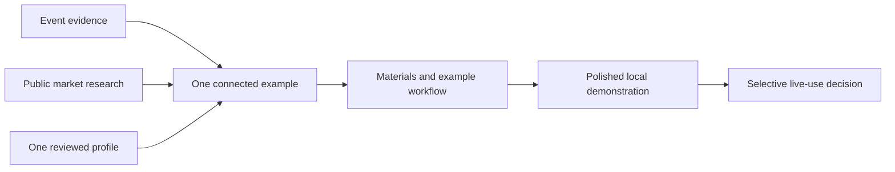

# Detailed workstream strategies

[Reference pack](../README.md) · [Overall plan](../PLAN.md) · [Tools map](../TOOLS-AND-CONNECTORS.md) · [Internal decisions](../INTERNAL-DECISIONS.md)

These eight strategies are the reusable working instructions for the Carnegie POC. Each chunk has a concrete output, an independent starting point, a detailed method, and a quality standard. They are **planned work**, not completed deliverables or authorization to operate external systems.

All eight strategies are living documents. Revise the affected strategy during the same work session when new evidence, accepted choices, or verified implementation changes it. [Current progress](../PROGRESS.md) records what actually exists and why a material decision changed; [shared instructions](../../../AGENTS.md) keep the collaboration and learning practice consistent. Do not rewrite unrelated strategies for every small edit.

The shared outcome is a convincing, source-backed demonstration for **March 3, 2027** that Troen can inspect without first doing homework. An employee reports one participating group; **ten additional ensembles is a provisional target requiring capacity confirmation**. No demo should present that target as confirmed available inventory.

## Choose the chunk by its output

| Strategy | What it produces | What it can start from now |
|---|---|---|
| [01 — Evidence and event model](01-evidence-and-event-model.md) | Reusable event facts, claim notes, and a source-backed event story | Existing logistics and business-context review |
| [02 — Market and provider research](02-market-and-provider-research.md) | Fair provider comparison and channel hypotheses | Public provider information and the existing offer evidence |
| [03 — Prospect discovery and verification](03-prospect-discovery-and-verification.md) | Small opportunity workbook with defensible profiles | Existing candidate library and public school/partner sources |
| [04 — POC experience and design](04-poc-experience-and-design.md) | Coherent local presentation of the five deliverables | One real profile, the event story, and clearly illustrative workflow data |
| [05 — Director and partner materials](05-director-and-partner-materials.md) | Editable audience-specific sheets, FAQ, and proposal example | Supplied brochure, research profiles, and documented logistics |
| [06 — Opportunity workflow and briefings](06-opportunity-workflow-and-briefings.md) | Example pipeline, handoffs, and weekly action brief | Synthetic scenarios informed by the supplied workflow examples |
| [07 — Software and automation fit](07-software-and-automation-fit.md) | Local automation candidate and a future integration fit map | Existing Python tools and the received Zoho report |
| [08 — Iteration, verification, and delivery](08-iteration-and-delivery.md) | Small build increments, verification evidence, and a usable handoff | The current repository and these strategies |

## Suggested construction sequence

Start with the event evidence and one school or partner profile. Use those to draft one audience material and a short illustrative follow-up sequence. Put that connected example in front of the logistics and software developer for inspection. Revise the useful pattern, then extend it into the small workbook, comparison, and complete demonstration.

Market research can proceed while the event evidence is organized. Design can begin with a sourced sample and labeled placeholders. The workflow example can be built using synthetic records while prospect research continues. None of these require Zoho access or a complete relationship list.

The sequence describes how to build the POC, not a ranking of sales channels. Existing relationships, partners, and new schools are all hypotheses to explore. No channel has demonstrated superior results for Troen.

## Shared handoff rules

- Carry the same event identifier, source references, and evidence labels through the workbook, documents, and presentation.
- Use **logistics and software developer** as the project role; use **employee-reported** for the relayed business reports.
- Keep original source material unchanged. Separate source-backed facts, interpretations, and illustrative records.
- Proposed artifact names inside these strategies describe future outputs. They are not links to files that already exist.
- Each completed increment records what works, what was verified, what is illustrative, and its next smallest useful improvement.
- Use the [internal register](../INTERNAL-DECISIONS.md) at the relevant live-use decision, not as a kickoff questionnaire.
- Stop a chunk when its concrete output is useful and verified. Do not turn a POC task into a CRM, payment system, full travel platform, or broad research campaign.

## Resuming later

Read the relevant strategy, the current project instructions, and the latest actual artifacts before acting. Check repository changes so earlier work is preserved. Execute one bounded increment, inspect it, and verify the behavior or claims being changed. Update implementation status only after the artifact exists and has been checked. These strategies remain the rationale; later execution notes record what actually happened.
